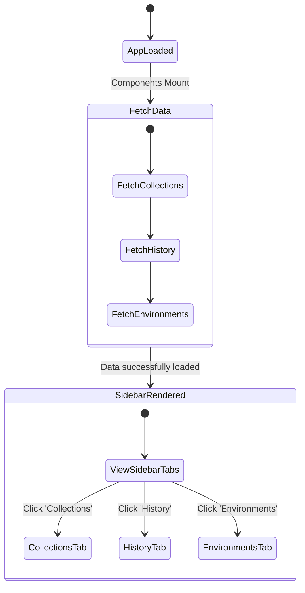
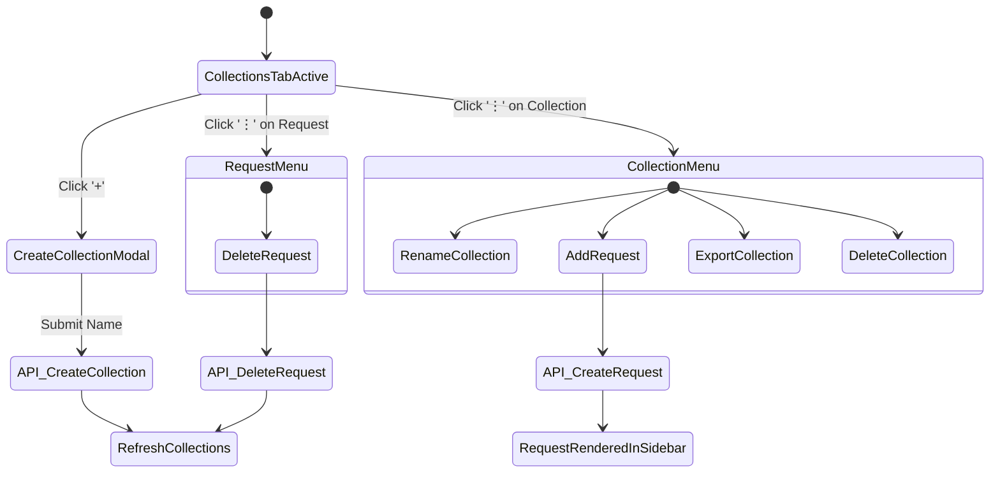
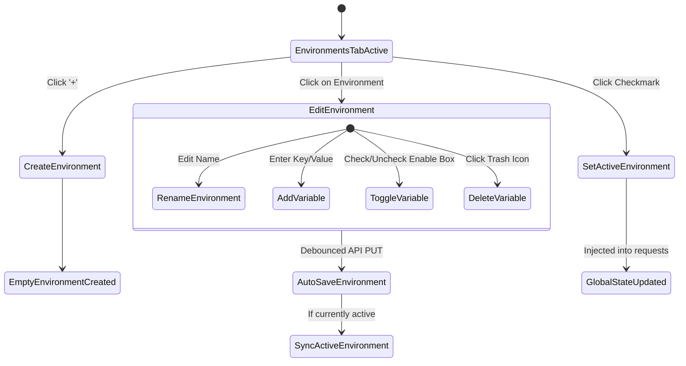
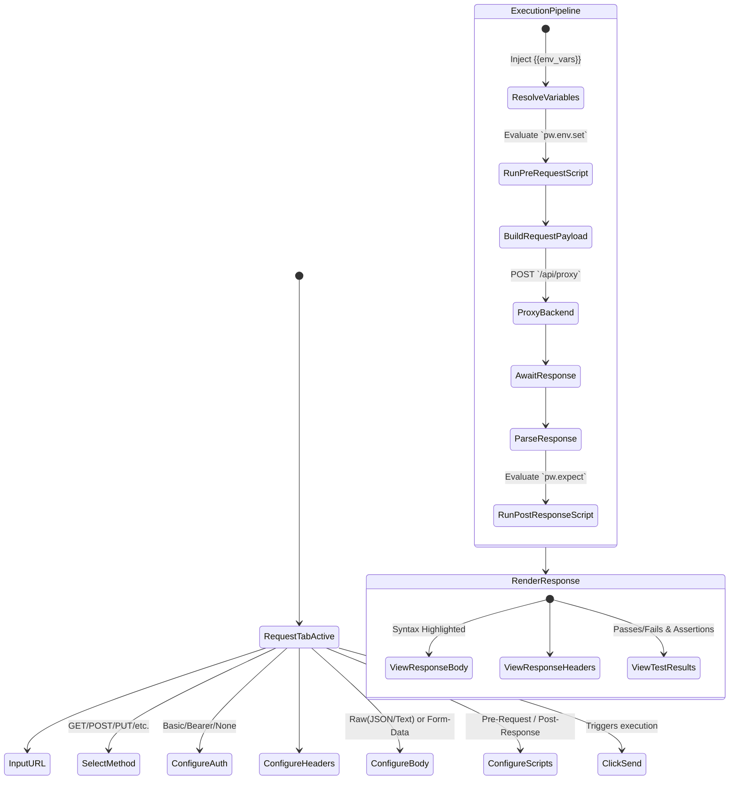
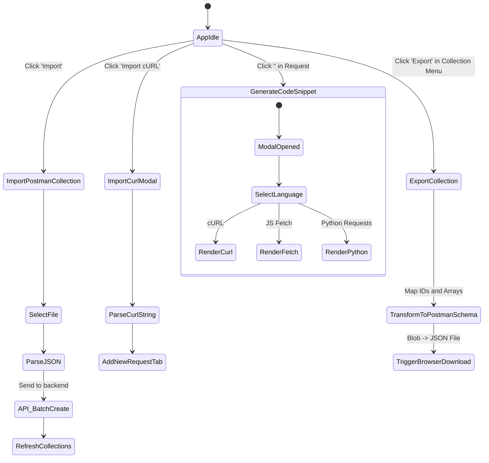

# Postwoman Flows

This document contains comprehensive Mermaid diagrams illustrating all user journeys, UI interactions, and core functional flows of the Postwoman application.

## 1. Application Initialization & Navigation Flow



## 2. Tab & Workspace Management Flow

```mermaid
stateDiagram-v2
    [*] --> WorkspaceActive
    
    WorkspaceActive --> CreateNewTab: Click '+' in tab bar
    CreateNewTab --> EmptyRequestTabOpened
    
    WorkspaceActive --> OpenExistingRequest: Click request in Sidebar
    OpenExistingRequest --> CheckExistingTabs
    
    state CheckExistingTabs {
        [*] --> TabAlreadyOpen: Is req in tabs?
        [*] --> NewTab: Not in tabs
        TabAlreadyOpen --> SetActiveTab
        NewTab --> FetchRequestData --> AddTab --> SetActiveTab
    }
    
    WorkspaceActive --> CloseTab: Click 'x' on tab
    CloseTab --> RemoveFromState
    RemoveFromState --> FallbackToPreviousTab: If tabs remaining
    RemoveFromState --> EmptyWorkspace: If no tabs left
```

## 3. Collections & Requests Management Flow



## 4. Environment Management Flow



## 5. Request Configuration and Execution Flow



## 6. Import, Export, and Code Generation Flow


